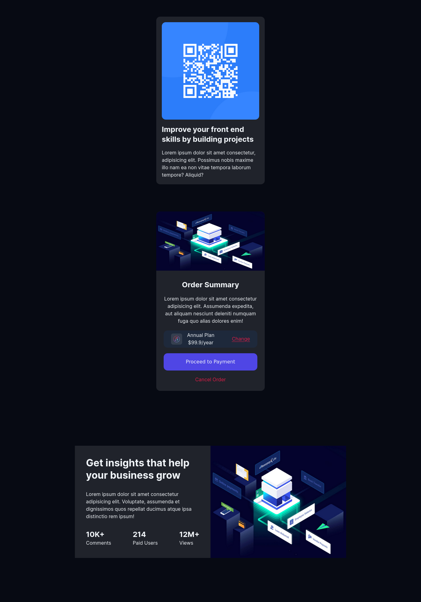

# CSS Cards Project

This folder contains a collection of cards designed using HTML and CSS. The designs are based on a challenge from Frontend Mentor and are intended to help improve front-end development skills.

## Table of Contents

- [Overview](#overview)
- [Features](#features)
- [Technologies Used](#technologies-used)
- [Usage](#usage)
- [License](#license)

## Overview

This project consists of three card designs, each showcasing different aspects of HTML and CSS styling. The cards include a QR code card, an order summary card, and a business insights card.

## Features

- Clean UI
- Use of CSS Flexbox for layout

## Technologies Used

- HTML5
- CSS3

## Usage

Feel free to use these card designs in your own projects. You can modify the HTML and CSS to better fit your needs.

## License

This project is licensed under the MIT License. See the [LICENSE](LICENSE) file for details.
