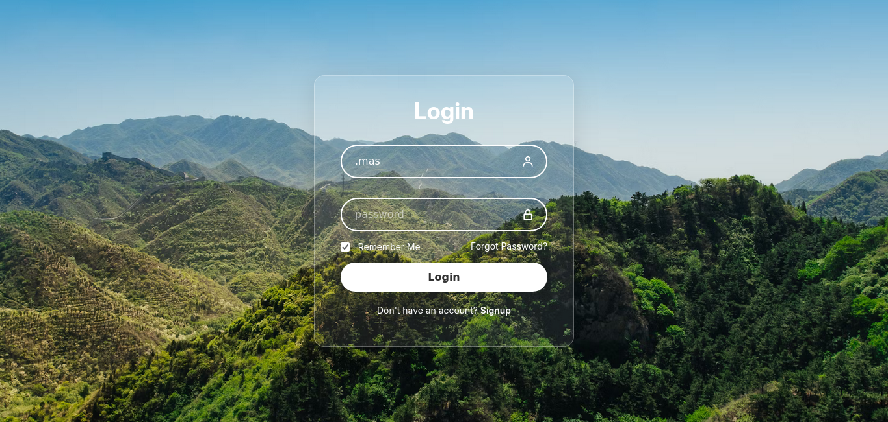

# Glassmorphic Login Page

This repository contains the code for a login page designed using the Glassmorphism design concept. This project was created as part of a learning exercise to explore and implement Glassmorphic UI elements.

## Technologies Used

- HTML
- CSS

## Screenshot

## License

This project is licensed under the MIT License - see the [LICENSE](LICENSE) file for details.
